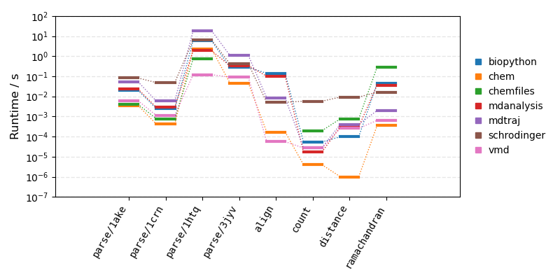

# PDB benchmark

A series of tests to measure performance in handling PDB files.
This was originally developed to compare [chem.cr](https://github.com/franciscoadasme/chem.cr) capabilities with
widely-used libraries and programs.

Heavily inspired by [PDB benchmarks](https://github.com/jgreener64/pdb-benchmarks).

## Benchmark

### Tests

The benchmark includes the following tests:

- Parsing PDB files.
  - [1CRN](http://www.rcsb.org/pdb/explore/explore.do?structureId=1crn) - hydrophobic protein (327 atoms).
  - [1AKE](http://www.rcsb.org/pdb/explore/explore.do?structureId=1ake) - protein-ligand complex (3,816 atoms).
  - [3JYV](http://www.rcsb.org/pdb/explore/explore.do?structureId=3jyv) - 80S rRNA (57,327 atoms).
  - [1HTQ](http://www.rcsb.org/pdb/explore/explore.do?structureId=1htq) - multicopy glutamine synthetase (10 models of 97,872 atoms).
- Counting the number of alanine residues.
- Calculating the distance between residues 50 and 60 of chain A.
- Calculating the Ramachandran phi/psi angles.
- Aligning the coordinates of the system to itself (avoid selection/matching issues).

The tests are implemented according to the official documentation of each library, using examples from tutorials and guides as reference.
Optimized versions may be faster but often require advanced (possibly undocumented) usage.

Tests except parsing PDB files were run with 1AKE (3,816 atoms).
Elapsed times are averaged over ten runs (except for 1HTQ, 3 runs) for every test.

### Software

| Library                                               |        Version | Language   | Language version |
| ----------------------------------------------------- | -------------: | ---------- | ---------------: |
| [Biopython](https://biopython.org/)                   |           1.84 | Python     |           3.12.7 |
| [chem.cr](https://github.com/franciscoadasme/chem.cr) | 0.6.0 (master) | Crystal    |           1.13.1 |
| [Chemfiles](https://chemfiles.org)\*                  |         0.10.4 | C++/Python |           3.12.7 |
| [MDAnalysis](https://www.mdanalysis.org)              |          2.7.0 | Python     |           3.12.7 |
| [MDTraj](https://mdtraj.org)                          |         1.10.0 | Python     |           3.12.7 |
| [Schrodinger](https://www.schrodinger.com)            |         2023-4 | C++/Python |           3.8.10 |
| [VMD](https://www.ks.uiuc.edu/Research/vmd)           |          1.9.4 | C/Tcl      |                  |

\* Chemfiles C++ version was not tested as most people would probably use it from Python.
C/C++ is often complicated to write and build, which could be cumbersome for most scientists.

> [!NOTE]
> Python libraries listed here may internally use C-powered code for some performance-critical code such as distance calculation.
> In the other hand, C/Tcl and C++/Python libraries are implemented in pure C/C++ and offer access from Tcl/Python through bindings.

### Hardware specification

All tests were run on the following hardware:

- CPU: AMD Ryzen 9 5950X 16-Core Processor @ 3.40GHz
- RAM: 32 GB 3733 MHz DDR4
- SSD: Seagate FireCuda 520 NVMe
- OS: Pop! OS 22.04 LTS

## Installation

Either clone or download this repository.

### Requirements

The following programs and libraries must be installed and available in the executable path:

- Crystal compiler
- Python interpreter
  - BioPython
  - Chemfiles
  - MDAnalysis
  - mdtraj
- Schrodinger's Maestro
- VMD software

Python libraries can be installed via either PIP or Conda.
Please refer to the official documentation for installation instructions.

Once all requirements are installed, set up the environment by doing the following:

- Add the `scripts` directory to the `PYTHONPATH` environment variable.
- Set `SCHRODINGER` environment variable to the Schrodinger installation directory.
- Ensure that the `vmd` executable is accessible
- Install the `chem.cr` library and then build the test executables for `chem.cr`:

```console
$ shards install
$ shards build --release --mcpu=native
```

## Usage

To run the benchmark, simply run the `run.py` script:

```shell
$ python scripts/run.py
biopython/count/1ake                    0.000191
chem/count/1ake                         0.000009
chemfiles/count/1ake                    0.000300
mdanalysis/count/1ake                   0.000036
mdtraj/count/1ake                       0.000075
schrodinger/count/1ake                  0.026060
vmd/count/1ake                          0.000173

biopython/distance/1ake                 0.000162
chem/distance/1ake                      0.000000
chemfiles/distance/1ake                 0.000998
mdanalysis/distance/1ake                0.000378
mdtraj/distance/1ake                    0.000936
schrodinger/distance/1ake               0.041747
vmd/distance/1ake                       0.000381
```

You can select which tests to run and libraries to test via the `-t/--tests` and `-l/--libraries` options, respectively.

## Results

The following figure and table show the runtimes obtained for each test in the benchmark.
There are clear differences in performance, where a given software can be orders of magnitude (note the logarithmic scale in the figure) faster than others, depending on the test.

> [!IMPORTANT]
> Direct comparison of parsing times should be taken with a grain of salt because each library does something slightly different, _e.g._ error checking.
> Some of this functionality is listed below.
> Nonetheless, these results gives an overall picture in terms of the expected performance.



|                           | Biopython |   chem.cr | Chemfiles | MDAnalysis | MDTraj | schrodinger |       VMD |
| ------------------------- | --------: | --------: | --------: | ---------: | -----: | ----------: | --------: |
| Parse 1AKE [ms]           |    20.056 | **3.538** |     4.074 |     23.316 | 54.025 |      82.276 |     6.082 |
| Parse 1CRN [ms]           |     2.478 | **0.418** |     0.773 |      2.828 |  5.835 |      48.180 |     1.127 |
| Parse 1HTQ [s]            |     5.857 |     2.278 |     0.732 |      1.871 | 18.589 |       6.400 | **0.120** |
| Parse 3JYV [s]            |     0.280 | **0.046** |         × |      0.333 |  1.089 |       0.417 |     0.090 |
| Align [ms]                |   139.757 |     0.168 |         - |    101.035 |  8.409 |       5.056 | **0.056** |
| Count [ms]                |     0.054 | **0.004** |     0.196 |      0.017 |  0.028 |       5.757 |     0.027 |
| Distance [ms]             |     0.098 | **0.001** |     0.764 |      0.310 |  0.405 |       9.214 |     0.257 |
| Ramachandran [ms]         |    44.191 | **0.353** |   289.154 |     36.253 |  1.977 |      16.171 |     0.639 |
|                           |           |           |           |            |        |             |           |
| License                   | Biopython |       MIT |       BSD |      GPLv2 |   LGPL | Proprietary |       VMD |
| Parse Header              |       yes |       yes |       yes |         no |     no |          no |        no |
| Parse CONECT              |        no |       yes |       yes |         no |    yes |         yes |       yes |
| Parse Secondary Structure |        no |       yes |       yes |         no |     no |          no |        no |
| Hybrid36                  |        no |       yes |        no |        yes |     no |          no |        no |
| Supports disorder         |       yes |       yes |        no |         no |    yes |         yes |        no |
| Hierarchical parsing      |       yes |       yes |        no |         no |     no |          no |        no |
| Guess bonds               |        no |   yes\*\* |     yes\* |         no |  yes\* |         yes |       yes |

\- Does not support feature. \
× Failed test. \
\* Assign bonds based on connection table for standard protein residues. \
\*\* Same as \*, but checks bond distances.

Latest update: 2024-10-18

## Contributing

Please open a pull request for adding a new software or improving the test code, as optimal code may run faster.
The benchmark will be run again and runtimes will be updated accordingly.

1. Fork it (<https://github.com/franciscoadasme/pdb-bench/fork>)
2. Create your feature branch (`git checkout -b my-new-feature`)
3. Commit your changes (`git commit -am 'Add some feature'`)
4. Push to the branch (`git push origin my-new-feature`)
5. Create a new Pull Request

## Contributors

- [franciscoadasme](https://github.com/franciscoadasme) Francisco Adasme -
  creator, maintainer.

## License

Licensed under the MIT license, see the separate LICENSE file.
